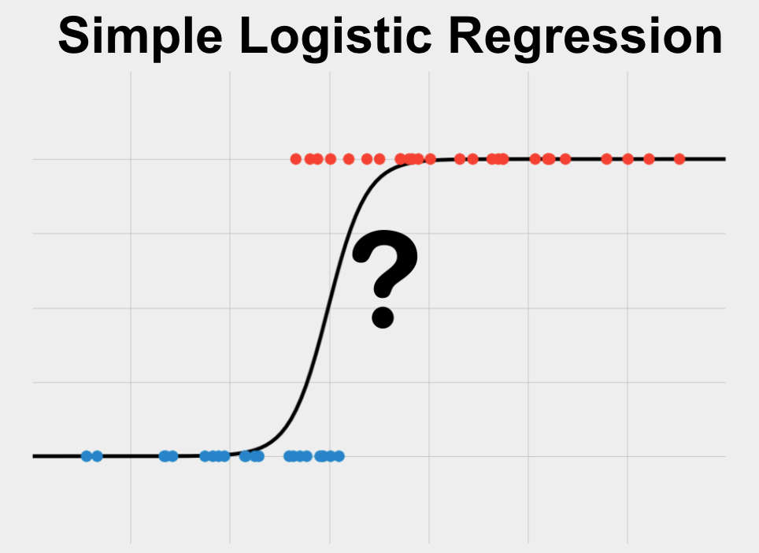

```{r setup, include=FALSE}
library(tidyverse)
```

# Introduction

R is an integrated suite of software facilities built by statisticians used for:
  - data manipulation
  - calculation
  - graphical display
  - an effective data handling and storage facility
  - a suite of operators for calculations on arrays, in particular matrices
  - a large, coherent, integrated collection of intermediate tools for data analysis
  - a well developed, simple and effective programming language (called ‘S’) which includes:
    - conditionals
    - loops
    - user defined recursive functions
    – input and output facilities.

Some other extensions of R that people commonly use:
  - RStudio (this is what you're looking at)
  - RMarkdown (using Latex)
  - Supported packages (dplyr, ggplot, magrittr)
  - and more packages (github, BioConductor)
  - whole package universes (tidyverse)
  - applications (shiny apps)
  - presentations
  - and more!
  
R is currently in version 4.1.3
  
For data science R can do just about everything that python can--and there are many similarities between the two. Recently, there has been more and more interest in combining the strengths of both languages to do better data science.

R was originally built for stats, but has evolved to excel at many parts of data science.

# R Basics

In my opinion, there are really two kinds of R. Base R, and the tidyverse.

```{r}
# base R

## 1-dimensional objects

# character vector = array
vector1 <- c("a", "b", "c")
vector1
print(vector1)
class(vector1)

vector1[1]
vector1[2,3] # Doesn't work
vector1[c(2,3)]

# numeric vector = array
vector2 <- c(1, 2, 3)
vector2
class(vector2)

# list
list1 <- c("crowd" = "a", b = 12, c = "seven")
list1

list1[1]
list1[2] + 1 # Doesn't work
as.numeric(list1[2]) + 1
# as.character
# as.numeric
# as.factor etc.

# factor
factor1 <- factor(c("a", "b", "c", "b", "b"))
factor1
list(factor1)

factor1[3]
factor1["a"] # Doesn't work
levels(factor1)

## two-dimensional objects

# martix
matrix1 <- matrix(data = c(vector1, vector2), ncol = 2)
matrix1
class(matrix1)

matrix1[3,1]
matrix1[6]
matrix1[1,]

# data frame = table
dataframe1 <- data.frame(col1 = c(matrix1, 78, 44), col2 = 1:8)
dataframe1
class(dataframe1)

dataframe1$col2
dataframe1[3,]
```

# Data Cleaning

We've got basic structures under our belt, lets get to the cool stuff.

You can clean  + manipulate data in R very easily, and in my opinion, quite intuitively too. I like using the tidyverse, but here I show both base R and tidyverse methods.

```{r tidyr}
# tidyverse
data("mtcars")
class(mtcars)

# standard head() function
head(mtcars)
glimpse(mtcars)

# filter
# I just want to see rows with this value
mtcars$mpg
mtcars$mpg <= 15
mtcars[mtcars$mpg <= 15,]
dplyr::filter(mtcars, mpg <= 15)

# select
# I only want columns with this name
mtcars[,c("disp", "wt")]
dplyr::select(mtcars, disp, wt)

# mutate
# I want to change a variable
mtcars$plums <- mtcars$disp / mtcars$cyl
print(mtcars$plums)
dplyr::mutate(mtcars, plums = disp - cyl)

# Row-dependent mutate
mtcars["pears"] <- ifelse(mtcars$cyl == 8, mtcars$disp / mtcars$cyl, 0)
print(mtcars[,c("pears", "plums")])
dplyr::mutate(mtcars, pears = ifelse(cyl == 8, disp / cyl, 0))
```
The tidyverse is home to other methods as well:

  - The pipe operator and others from {magrittr} %>%
  - Plotting methods from {ggplot2}
  - and other improved read/write, string, and object type abilities
  
# Visualization

**base vs ggplot2**

```{r}
#scatter
plot(mtcars$hp, mtcars$mpg)

ggplot(mtcars) + geom_point(aes(x = hp, y = mpg))

#histogram
hist(mtcars$cyl)

ggplot(mtcars) + geom_histogram(aes(x = cyl))
```
# Machine Learning {.tabset}

All models are wrong, but some are useful!

There are two main classes of ML:
[R-C](figs/regression-vs-classification-in-machine-learning.png)

  - Regression
    - Line of best fit
    - Predicts a continuous variable
    - It's the model's job to find parameters that minimize the distance between the line and the observed data
  
  - Classification
    - Predicts discrete classes
    - The model can find parameters that minimize the prediction of incorrect category labels (Decision Boundary)
  
### In practice

  - Use features to predict an outcome using training data

  - Extract the model

  - Use the model to predict new outcomes

We will use Fitbit data, courtesy fo Gloria on Kaggle 

[Fitbit Data](https://www.kaggle.com/datasets/gloriarc/fitbit-fitness-tracker-data-capstone-project)


## Case 1 Linear/Polynomial Regression

For this exercise, say we want to look at the relationship between the number of calories burned (**Calories**) and the distance that people traveled according to the device (**Tracker Distance**)

```{r}

# read in data
fitbit <- read_csv("data/Daily_Activity_2022_27_02.csv")

# view the data
glimpse(fitbit)

# plot our variables of interest
plot(fitbit$TrackerDistance, fitbit$Calories)

# no data manipulation required
mod1 <- glm(Calories ~ `TrackerDistance`, data = fitbit)

# get summary
summary(mod1)

# make a line
range(fitbit$TrackerDistance)
pred <- predict(mod1, data.frame(TrackerDistance = seq(0, 30, 0.1)), type = "response")
predat1 <- data.frame(pred = pred, dist = seq(0, 30, 0.1))

# polynomial model
mod2 <- glm(Calories ~ poly(`TrackerDistance`, 3), data = fitbit)

# summary
summary(mod2)

# another line
range(fitbit$TrackerDistance)
pred <- predict(mod2, data.frame(TrackerDistance = seq(0, 30, 0.1)), type = "response")
predat2 <- data.frame(pred = pred, dist = seq(0, 30, 0.1))


# plot all models and data
ggplot() + geom_line(data = predat1, aes(x = dist, y = pred), color = "blue", size = 1.5, lty = 2) +
  geom_line(data = predat2, aes(x = dist, y = pred), color = "red", size = 1.5, lty = 2) +
  geom_point(data = fitbit, aes(x = TrackerDistance, y = Calories)) +
  labs(x = "Tracker Distance", y = "Calories") +
  theme_classic()
```

## Case 2 Logistic Regression



Even though regression is in the name, it is used for binary classification:
  - Is it black or white? Male or female? etc.
  
This model estimates the parameters of a logistic equation for the probability of an observation residing in a particular class.

In this example, let's say we want to predict high or low calorie count using the day of the week and how far the user traveled.


```{r}

# read in data
fitbit <- read_csv("data/Daily_Activity_2022_27_02.csv")

# data manipulation
fitbit <- dplyr::mutate(fitbit, dvcal = ifelse(Calories >= 2000, "high", "low"))

# view our new variable
boxplot(fitbit$TrackerDistance ~ fitbit$dvcal, ylab = "Tracker Distance", xlab = "Calories Burned")

# create the model
mod1 <- glm(formula = factor(dvcal) ~ TrackerDistance, data = fitbit, family = "binomial")

pred <- predict(mod1, data.frame(TrackerDistance = seq(0, 30, 0.1)), type = "response")
predat <- data.frame(pred = pred, dist = seq(0, 30, 0.1))

# view results
summary(mod1)

# plot them with ggplot
ggplot() + geom_line(data = predat, aes(x = dist, y = pred), color = "blue", size = 1.5, lty = 2) +
  geom_point(data = fitbit, aes(x = TrackerDistance, y = ifelse(dvcal == "high", 1, 0))) +
  labs(x = "Tracker Distance", y = "Calories") +
  theme_classic()

```

## Method 3 Random Forest

```{r}
library(caret)
library(randomForest)

# using mtcars
# some cleaning

glimpse(fitbit)

data <- dplyr::mutate(fitbit, aday = factor(ActivityDay)) %>% # as a factor
  dplyr::select(-ActivityDay, -`...17`, -`...18`, -Id, -dvcal, -ActivityDate)

#10 folds repeat 3 times
control <- trainControl(method = 'repeatedcv', 
                        number = 10, 
                        repeats = 3)

#Metric compare model is Accuracy
metric <- "Accuracy"

# set seed for reproducibility
set.seed(123)

# creating tuning grid
# How many variables should each tree use?
tunegrid <- expand.grid(.mtry = 1:10)
rf_default <- train(aday ~ .,
                    data = data, 
                    method = 'rf', 
                    metric = 'Accuracy',
                    tuneGrid = tunegrid, 
                    trControl = control)

# view summary
print(rf_default)

#plot results
plot(rf_default)
```


## R Markdown

This is an R Markdown document. Markdown is a simple formatting syntax for authoring HTML, PDF, and MS Word documents. For more details on using R Markdown see <http://rmarkdown.rstudio.com>.

When you click the **Knit** button a document will be generated that includes both content as well as the output of any embedded R code chunks within the document. Note that all your code must be void of errors before knitting. You can embed an R code chunk like this:

```{r cars}
summary(cars)
```

## Including Plots

You can also embed plots, for example:

```{r pressure, echo=FALSE}
plot(pressure)
```

Note that the `echo = FALSE` parameter was added to the code chunk to prevent printing of the R code that generated the plot.
